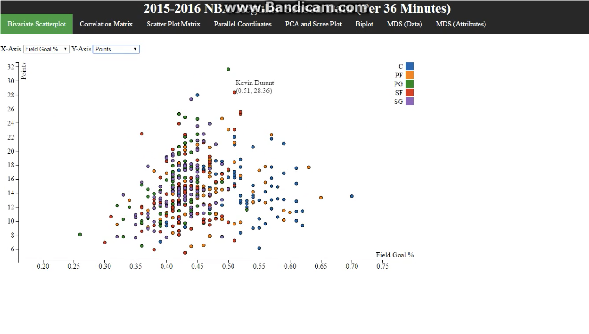
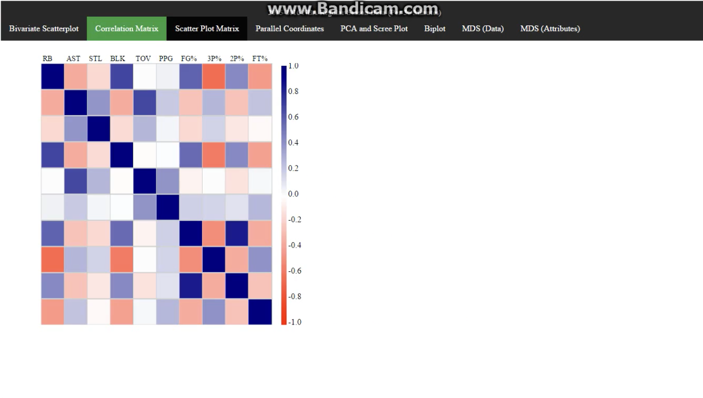
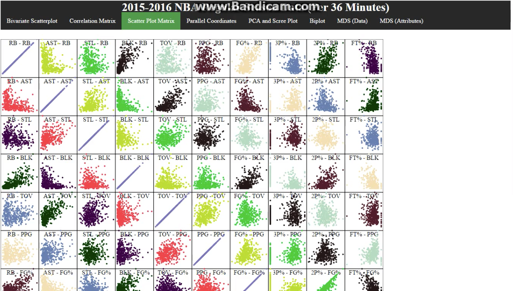
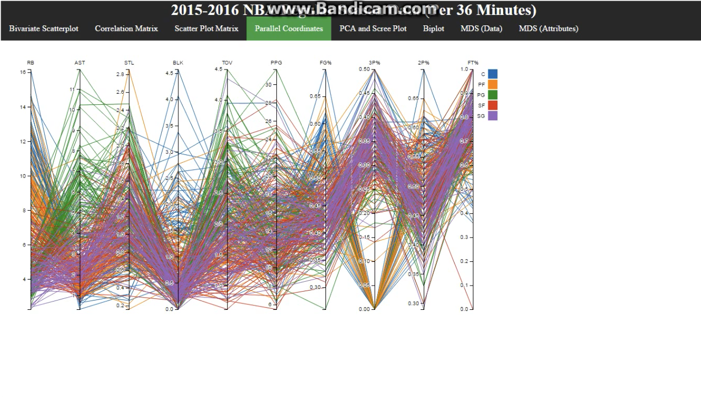
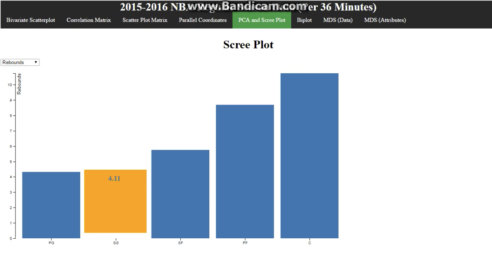

# nba-d3
- CSE 332 Introduction to Visualization | Fall 2016
  - https://www.cs.stonybrook.edu/students/Undergraduate-Studies/courses/CSE332
- Practice with D3.js and Python Pandas

## Video
https://github.com/allenlin113/nba-d3/assets/16393494/59427418-f6de-46e5-bee0-02f03c51a58c

## Screenshots

